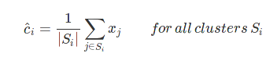

# K-Means
A numpy implementation of K-Means Clustering using Lloyd's Algorithm

**Initialization**
Choose K centroids for K clusters
1. Choose any random data point as the first centroid (C1)
2. Choose subsequent centroids as per the following formula:

**Allocate points to centroids**
Allocate every point xj to a cluster as per the following formula

**Re-compute centroids**
Re-Compute centroids for all clusters as per the following formula

***The allocation and re-computation steps are repeated until the clusters stablize***

**Clustering in action**

<i>10 clusters</i>

<i>3 clusters</i>